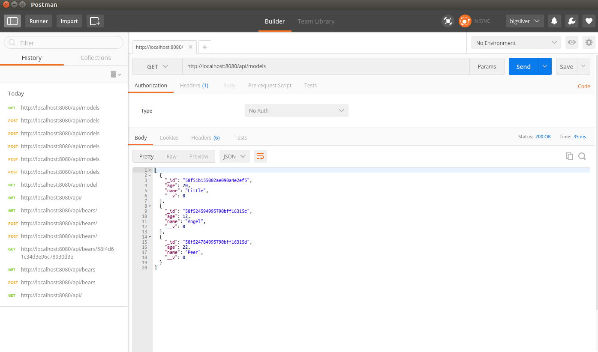

# Building a CRUD RESTful API Using Node and Express

## About

Using the new Express 4.0 Router to build an API.
This project is written by [Big Silver].

## Requirements

- Node and npm
- MongoDB

## Installation

- Clone the repo: `git clone https://github.com/Big-Silver/Node-RESTful-API.git Node-RESTful-API`
- Move to file: `cd Node-RESTful-API`
- Set up the MongoDB in server.js: `mongoose.connect('mongodb://127.0.0.1:27017/Your-Database');`
- Install dependencies: `npm install`
- Start the server: `node server.js`

## Testing the API
Test your API using [Postman](https://chrome.google.com/webstore/detail/postman-rest-client-packa/fhbjgbiflinjbdggehcddcbncdddomop)
